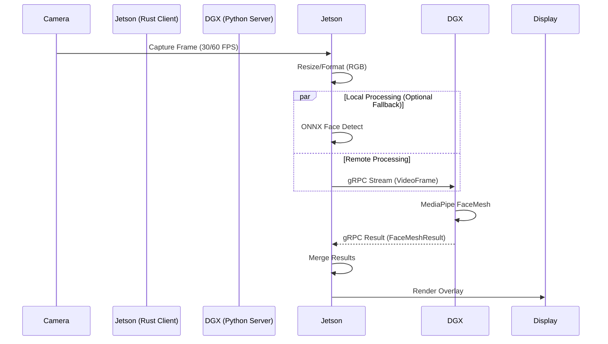

# Distributed Gaze Processing Architecture

## Overview
This specification details the distributed architecture for `rusty-eyes`, enabling high-performance gaze estimation by offloading heavy AI inference from the edge device (Jetson Nano) to a powerful GPU server (DGX Spark).

## System Architecture

## Components

### 1. Edge Client (`rusty-eyes`)
- **Language**: Rust
- **Responsibilities**:
  - Camera capture (`nokhwa`)
  - Video encoding/formatting
  - Bidirectional gRPC streaming (`tonic`)
  - Rendering overlay (`softbuffer`/`x11`)
  - Local fallback inference (`ort`)

### 2. Remote Server (`remote_server/`)
- **Language**: Python
- **Responsibilities**:
  - gRPC Service (`Method: StreamGaze`)
  - Process frames with MediaPipe Face Mesh
  - Health Monitoring (gRPC + REST)

## Protocols

### gRPC Streaming (`StreamGaze`)
- **Input**: Stream of `VideoFrame`
  - `bytes frame_data`: JPEG or Raw RGB
  - `int64 timestamp_us`: Synchronization timestamp
  - `string stream_id`: Client identifier
- **Output**: Stream of `FaceMeshResult`
  - `repeated Landmark landmarks`: 468 face points
  - `GazeVector gaze`: Estimated gaze direction (yaw/pitch)

### Health Check
- **gRPC**: Standard `grpc.health.v1` service.
- **REST**: `GET :8080/health` returning JSON status and stats.

## Deployment

### Server (DGX)
Deployed via `remote_server/deploy.sh` to user-space monitoring.
- **Ports**: 50051 (gRPC), 8080 (REST)
- **Service**: Runs as background `nohup` process.

### Client (Jetson)
Configured via `config.json` or CLI args.
- **Flag**: `--remote-dgx http://<host>:50051`
- **Config**: `"remote_dgx_url": "..."`
