# Stereo Gaze Tracking Specification (NVIDIA Metropolis / TAO)

## 1. Overview
This specification outlines the architecture for a high-performance **Stereo Eye Gaze Tracking System** using NVIDIA Metropolis (DeepStream SDK) and TAO Toolkit. The system fuses input from **two infrared cameras** (mounted Top-Left and Top-Right) to triangulate a user's 3D Point-of-Regard (PoR) on a display with minimal latency.

The solution is designed to run on:
- **Server**: NVIDIA DGX Spark (High throughput).
- **Edge**: NVIDIA Jetson Orin Nano Super (JetPack 6.2, Ubuntu 22.04).

## 2. Hardware Architecture

### 2.1 Cameras
- **Configuration**: Dual IR Cameras (Global Shutter preferred for synchronization).
- **Mounting**: Top-Left ($C_L$) and Top-Right ($C_R$) of the display plane.
- **Input Stream**: 
    - Physical: USB 3.0 or MIPI CSI-2.
    - Logical: Interleaved side-by-side stream OR two independent RTSP/USB sources.

### 2.2 Compute
- **Edge**: Jetson Orin Nano Super (8GB).
    - **OS**: Jetson Linux 36.4.3 (Ubuntu 22.04).
    - **SDK**: JetPack 6.2 (TensorRT 10.3, CUDA 12.6, DeepStream 7.0).
    - **Mode**: "Super Mode" (MaxN unconstrained) for 67 TOPS.
- **Server**: DGX Spark (`jowestdgxe`).
    - **SDK**: DeepStream 7.0 Docker container.

## 3. Software Pipeline (DeepStream)

The pipeline utilizes **NVIDIA DeepStream SDK** to ensure zero-copy memory transport (NVMM) between pipeline stages.

```mermaid
graph LR
    DualCam[Dual Camera Source] --> Mux[StreamMux]
    Mux --> PGIE[Primary GIE: FaceDetect]
    PGIE --> Tracker[NvTracker]
    Tracker --> SGIE[Secondary GIE: Landmarks]
    SGIE --> CustomProbe[Custom Crop Logic]
    CustomProbe --> TGIE[Tertiary GIE: GazeNet]
    TGIE --> Triangulation[Stereo Triangulation]
    Triangulation --> Smooth[Filter/Smooth]
    Smooth --> Sink[Output/Display]
```

### 3.1 Pipeline Stages

1.  **DeepStream Source (`nvurisrcbin`)**:
    *   Ingests the combined or dual streams.
    *   If combined (side-by-side), processing is simpler (one frame contains both views). If dual, we sync based on timestamps.
2.  **Primary GIE (Face Detection)**:
    *   **Model**: `PeopleNet` or `FaceDetect` (TAO Pre-trained).
    *   **Purpose**: Localize face bounding boxes in both Left and Right views.
3.  **Secondary GIE (Facial Landmarks)**:
    *   **Model**: `Flandmark` or `FaceMesh` (TAO/Retail).
    *   **Purpose**: Identify eye corners and pupils to guide cropping.
4.  **Data Preprocessing (Custom Probe/Plugin)**:
    *   **Action**: Using the Landmarks, extract the 4 required ROI tensors for GazeNet:
        1.  Face Crop (224x224)
        2.  Left Eye Crop (224x224)
        3.  Right Eye Crop (224x224)
        4.  Face Grid (Binary mask indicating face position relative to frame)
5.  **Tertiary GIE (GazeNet)**:
    *   **Model**: NVIDIA `GazeNet` (TAO Toolkit).
    *   **Input**: The 4 multi-input tensors from the previous stage.
    *   **Output**: 3D Gaze Vector ($\theta, \phi$) for each face in each view.

## 4. Stereo Triangulation Logic

We treat the Left View ($V_L$) and Right View ($V_R$) as two separate observations of the same subject.

### 4.1 Calibration (Extrinsics)
We must know the precise position/rotation of Camera L relative to Camera R.
- **Stereo Calibration**: Perform once using a checkerboard visible to both cameras.
- **Result**: Rotation matrix $R$ and Translation vector $T$.

### 4.2 Gaze Intersection
For a single moment $t$:
1.  **Left Ray**: Origin $O_L$ (Left Eye Center), Direction $D_L$ (from GazeNet).
2.  **Right Ray**: Origin $O_R$ (Right Eye Center), Direction $D_R$ (from GazeNet).
3.  **Geometry**: Find the point $P_{screen}$ where Ray L and Ray R effectively intersect (closest approach of two skew lines).
    *   Ideally, they intersect on the screen plane.
    *   Practically, we find the mid-point of the shortest segment connecting the two rays.

### 4.3 Screen Mapping
The 3D intersection point $P_{world}$ (in camera space) is projected to 2D screen pixels $P_{screen}$ (`(x, y)`) using system geometry (screen dimensions and offset from cameras).

## 5. Development Plan

### Phase 1: Model Preparation (TAO)
1.  Download `GazeNet` pretrained model from NGC.
2.  Convert to TensorRT (`.engine`) targeted for Orin Nano (FP16) and DGX (FP16/INT8).
3.  Validate accuracy on standard benchmarks using `tao-deploy`.

### Phase 2: DeepStream Pipeline (Python/C++)
1.  Construct the base pipeline: Source -> FaceDetect -> Display.
2.  Add Landmark detection.
3.  Implement the **Input Layer Plugin** to effectively crop and feed GazeNet. *Note: This is the most complex step; DeepStream usually handles simple ROIs. Multi-input models like GazeNet often require a custom `Gst-nvdspreprocess` config.*

### Phase 3: Stereo Logic
1.  Implement the calibration routine (OpenCV).
2.  Implement the Python/C++ logic probe to receive Gaze Vectors from both "Left Face" and "Right Face" (tracked via unique IDs or spatial regions).
3.  Compute intersection and stream result via gRPC (standardizing on our existing protocol).

### Phase 4: Integration
1.  Deploy to `jowestdgxe` (Docker).
2.  Deploy to `jetsone` (Orin Nano) using standard JetPack 6.x runtime.

## 6. References
- **NVIDIA TAO GazeNet**: [Link to NGC](https://catalog.ngc.nvidia.com/orgs/nvidia/teams/tao/models/gazenet)
- **DeepStream 3D Tracking**: [Link to Docs](https://docs.nvidia.com/metropolis/deepstream/dev-guide/text/DS_3D_Tracking.html)
- **Calibration**: OpenCV `stereoCalibrate`.
